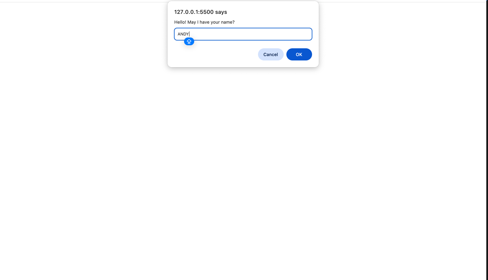
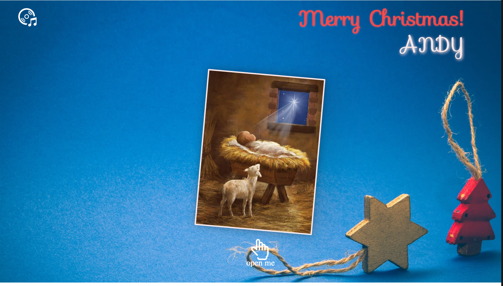

# 🎄 Christmas Web Card

A festive and interactive **Christmas Greeting Web Card**, featuring beautiful animations, custom audio and personalized messages which is perfect for sharing warmth during the holiday season!

---

## ✨ Features

- 🎁 Flip-style animated Christmas card
- 💬 Prompt user for name and personalize greeting
- 🖼️ Custom background and cover image
- 🔊 Background music with toggle button
- 📱 Responsive layout for desktop and mobile

---

## 🌐 Demo Preview

📸 **Screenshot**





---

## 💻 Technologies Used

- **HTML5**
- **CSS3 (Animations + Responsive Design)**
- **JavaScript (DOM Interaction + Audio Control)**
- **Bootstrap 4.6 (via CDN)**
- **Google Fonts (Sofia + Trirong)**

---

## 🚀 How to Run the Project

1. Clone the repo:
   ```bash
   git clone https://github.com/yourusername/christmas-web-card.git
   cd christmas-web-card
   ```
2. Open Christamscard.html in your browser, that's it! 🎉

---

## 🎯 Customization Tips
- 💡 You can change the background or cover image in style.css
- 🧑‍🎨 Customize fonts using Google Fonts
- 🎶 Replace silent night music with your own favorite holiday music

---

## 🙌 Author
Made with ❤️ by Zoe Wang
🌏 Brisbane, Australia | 🖥️ Front-End Developer in the Making

---

<p><i>May this Christmas bring joy and blessings to everyone you share this card with!</i></p>
